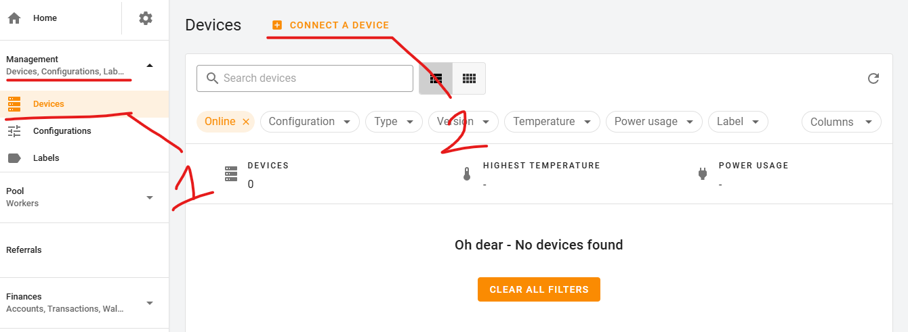
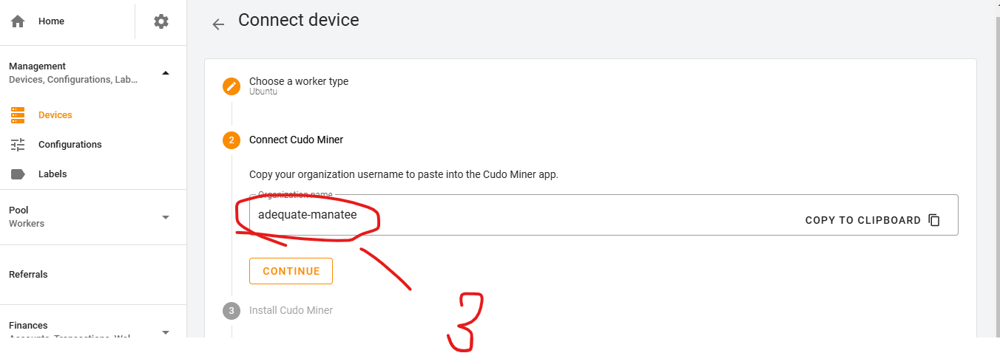
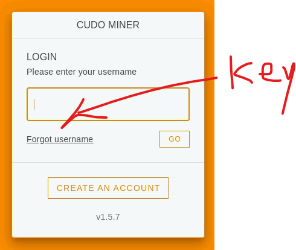
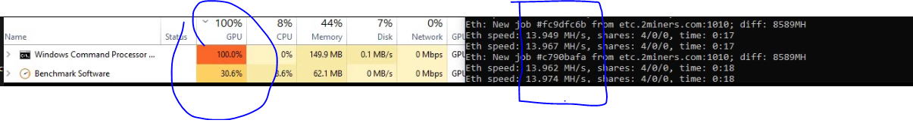
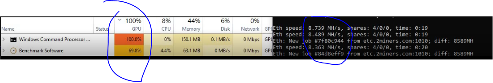
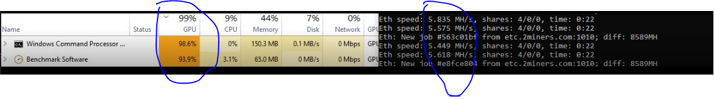
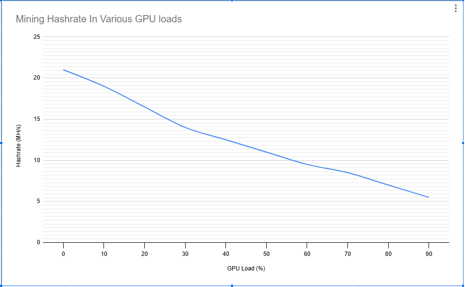
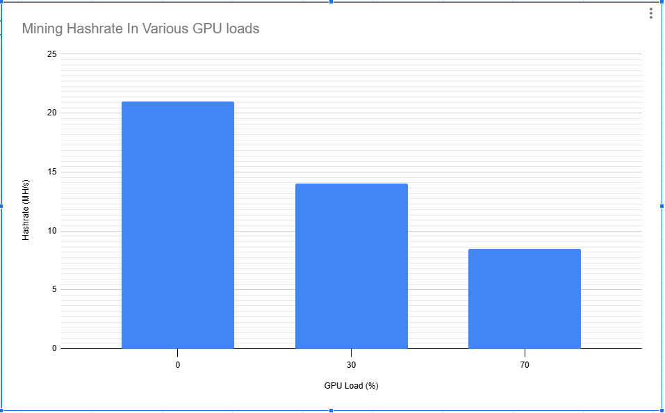

# Evaluating Mining Hashrate in various GPU loads
## 1. Abstract
- The purpose of this experiment is to evaluate mining hashrate under different GPU loads while training an AI model.

## 2. Methods
- GPU ( Nvidia GeForce RTX 2060 )
- GPU performance benchmark
- Mining application
    - Managing miners  
        - Login to miner management app  
        <a href="https://console.cudominer.com/" target="_blank">console.cudominer.com</a>
        - Get access key  
        
        
        
    - Mining application Installation  
        - ` sudo su -c "bash <(wget -qO- https://download.cudo.org/tenants/135790374f46b0107c516a5f5e13069b/5e5f800fdf87209fdf8f9b61441e53a1/linux/x64/stable/install.sh)" root `
        - Login to app using access key  
        

## 3. Results
- Normal Hashrate
    - 21 MH/s ( 5min average )
- When 30% of gpu is occupied by AI training
    - 14 MH/s
    - 
- When 70% of gpu is occupied by AI training
    - 8.5 MH/s
    - 

- When 90% of gpu is occupied by AI training
    - 5.5 MH/s
    - 
- Charts
    - 
    - 